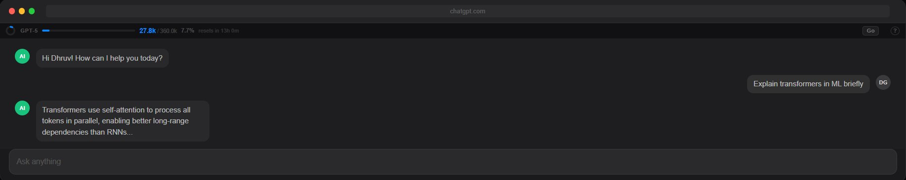
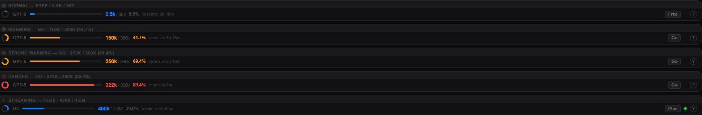

# ChatGPT Counter

A lightweight browser extension that tracks your **daily token usage** on [chatgpt.com](https://chatgpt.com) — with a real-time progress bar, model detection, and plan-aware limits.



---

## What It Looks Like

The counter bar sits at the top of every ChatGPT page and updates live as you chat.



Color changes based on how much of your daily limit you've used:
- 🔵 **Blue** — Normal usage
- 🟠 **Orange** — Warning (approaching limit)
- 🔴 **Red** — Danger (near limit)
- 🟢 **Pulsing dot** — ChatGPT is currently generating

---

## Features

- **Daily token tracking** — counts tokens across all chats, resets automatically at midnight
- **Per-chat memory** — switching between chats doesn't inflate your total
- **Model detection** — auto-detects GPT-4o, GPT-5, o3, o4-mini, GPT-4.1, etc.
- **Plan selector** — pick Free / Go / Plus / Pro to see the right limits and thresholds
- **Reset timer** — shows exactly how long until your daily count resets
- **Zero config** — no API key, no login, no setup required

---

## Plan Limits

| Plan | Daily Limit | Warn at | Danger at |
|------|-------------|---------|-----------|
| Free | 36K | 27K | 33K |
| Go | 360K | 150K | 250K |
| Plus | 1.5M | 750K | 1.25M |
| Pro | 5M | 2.5M | 3.75M |

> ⚠️ These limits are estimated from observed behavior — OpenAI doesn't publish official daily token caps. Treat numbers as a helpful approximation, not an exact meter.

> v2.0.0 — Real o200k_base tokenizer (accurate for gpt-4o, o1, o3, o4-mini). Replaces chars/4 estimate.
---

## Installation

### Chrome / Edge / Chromium

1. Download [chatgpt-tokens-counter.zip](https://github.com/Dhruvg0/Chatgpt-token-counter/releases/download/v2.0.0/chatgpt-counter-v2.zip)
2. Go to `chrome://extensions` and enable **Developer mode**
3. Drag and drop the zip onto the page

### Manual (from source)

1. Clone or download this repo
2. Go to `chrome://extensions` and enable **Developer mode**
3. Click **Load unpacked** and select the `chatgpt-tokens-counter` folder

---

## Browser Compatibility

| Browser | Supported |
|---------|-----------|
| Chrome | ✅ |
| Edge | ✅ |
| Brave | ✅ |
| Arc | ✅ |
| Firefox | ⚠️ Partial (Manifest V3 differs) |

---

## Privacy

- No external network requests — all data stays in your browser
- Only runs on `https://chatgpt.com/*`
- No analytics, no tracking, no background service worker
- Only permission used: `storage` (to remember your daily total and plan)

---

## Project Structure

```
chatgpt-tokens-counter/
├── manifest.json                # Extension manifest (v3)
├── icons/
│   ├── icon16.png
│   ├── icon48.png
│   └── icon128.png
└── src/
    ├── styles.css               # Counter bar styles
    ├── injected/
    │   └── bridge.js            # Fetch interceptor (MAIN world)
    ├── vendor/
    │   └── o200k_base.js        # Real tokenizer (gpt-4o, o1, o3, o4-mini)
    └── content/
        ├── bridge-client.js     # Injects bridge, postMessage relay
        ├── constants.js         # Model limits, plan limits, thresholds
        ├── ui.js                # Counter bar UI component
        └── main.js              # Token counting, navigation, storage
```

---

## License

MIT
